class: center
name: title
count: false

.p60[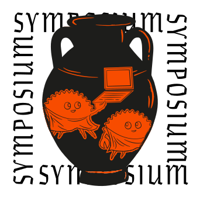]

## RIIIR: Rewrite It In *Idiomatic* Rust (with AI)

.me[.grey[*by* **Nicholas Matsakis**]]
.left[.citation[View slides at `https://nikomatsakis.github.io/qcon-ai-2026/`]]

---

# Who am I?

One of the lead designers of Rust

.center[.p60[]]

---

# Who am I?

Senior Principal Engineer at Amazon

.center[.p60[]]

---
# Takeaways

* Rust + AI = marshmallows + chocolate 🍫

---
# Takeaways

* Rust + AI = marshmallows + chocolate 🍫
* Symposium + Rust + AI = **s'mores** 😋

.p80[.center[]]

---
# Takeaways

* Rust + AI = marshmallows + chocolate 🍫
* Symposium + Rust + AI = **s'mores** 😋
* Portability across agents today is **hard** 😠

---
# Takeaways

* Rust + AI = marshmallows + chocolate 🍫
* Symposium + Rust + AI = **s'mores** 😋
* Portability across agents today is **hard** 😠
* Agent Client Protocol (ACP) **could solve it** 👏🏽

.abspos.top298.left310.width300px[]

---

# Not heard of Rust?

.abspos.top25.left519.width300px[]

*Low-level enough for a kernel...*

&nbsp;&nbsp;&nbsp;&nbsp;&nbsp;&nbsp;&nbsp;&nbsp;&nbsp; *usable enough for an application*

---

# Low-level enough for a kernel?

--

.abspos.top122.left98.width700px.bordered[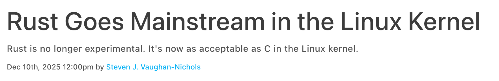]

--

.abspos.top282.left98.width700px.bordered[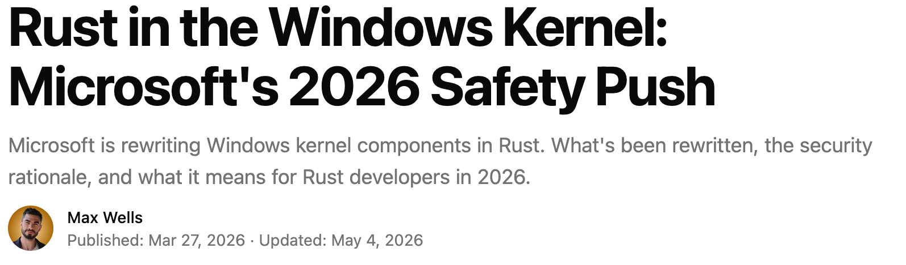]

---

# High-level enough for an application?

--

.abspos.left50.top180.bordered[
<video controls autoplay muted loop style="width: 800px">
<source src="./images/ratatui.webm" type="video/webm">
</video>
]

.abspos.top563.left236[TUI oscilliscope written using ratatui]

---

# "Eat your Spinach"

.center.p80[]

---

.center[
    .p40[]
    .p40[]
]


---

.center[
    .p40[]
    .p40[]
]

.center[.p60[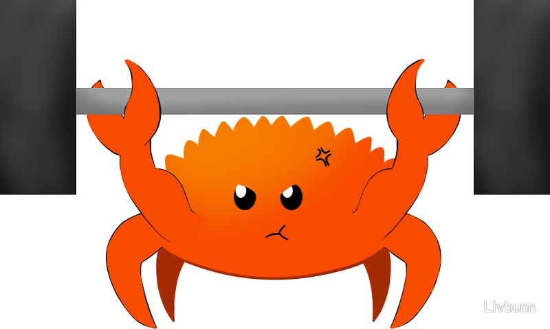]]

.footnote[
    [Strong ferris source](https://jackyzhen.github.io/rust-vs-go-slides/strongFerris.jpg)
]

---

# Rust + LLM = dream-team?

* Guardrails

--
template:guardrails

.p80[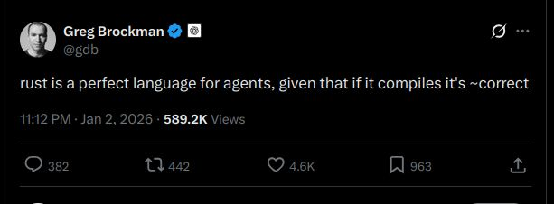]

.footnote[
    Co-founder and president of OpenAI.
]


---

# Rust + LLM = dream-team?

* Guardrails
* Versatility

--

.abspos.width600px.bordered.top212.left150[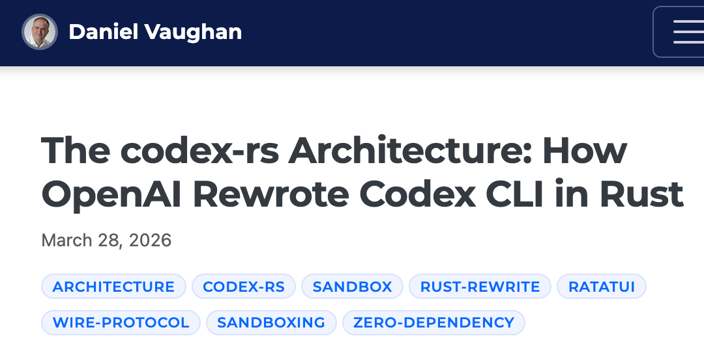]

---

# Rust + LLM = dream-team?

* Guardrails
* Versatility
* Efficiency

--

.abspos.top100.left295.width600px.bordered[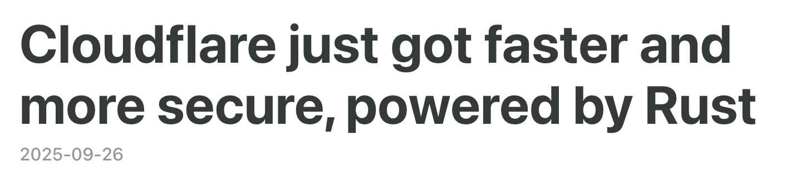]

.abspos.top229.left40.width600px.bordered[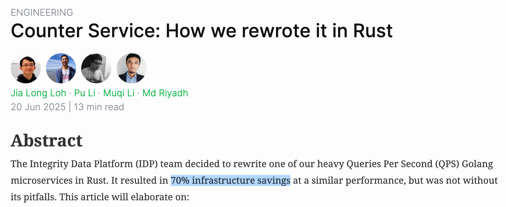]

.abspos.top332.left292.width600px.bordered[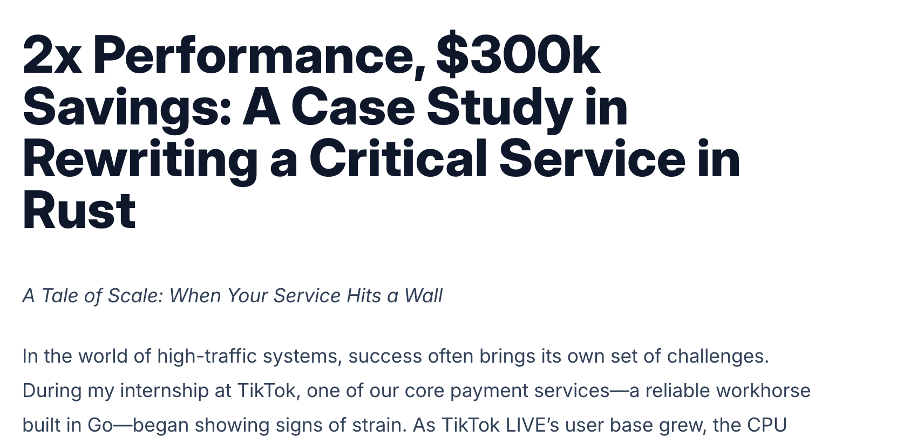]

---

# Rust at Amazon

.abspos.top62.left153[.p80[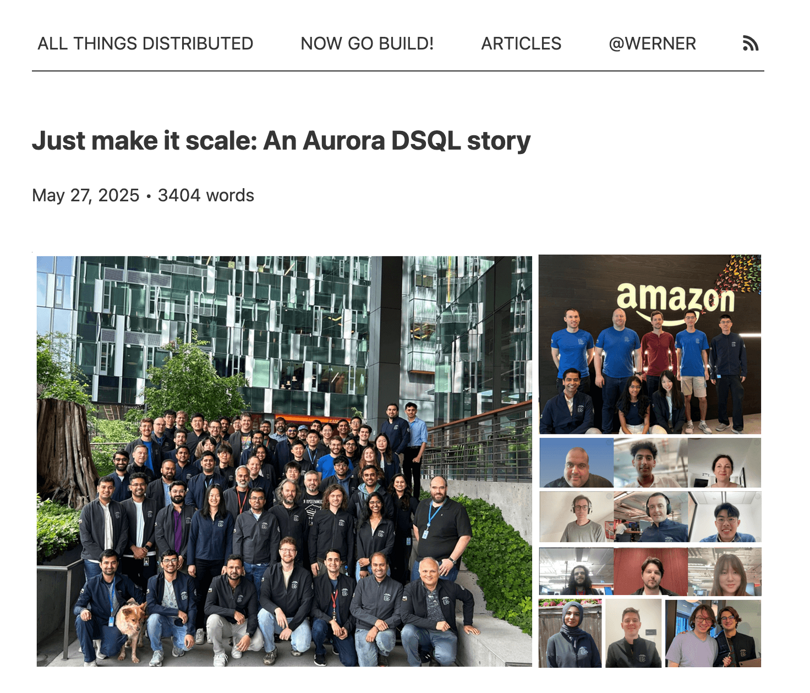]]

.footnote[
    [Link to blog post](https://www.allthingsdistributed.com/2025/05/just-make-it-scale-an-aurora-dsql-story.html)
]

---

# Latest developments for Rust at Amazon

--

.center.megamoj[
    🤐
]

---

# Microsoft

> My goal is to eliminate every line of C and C++ from Microsoft by 2030. Our strategy is to combine AI *and* Algorithms to **rewrite Microsoft’s largest codebases**. Our North Star is “1 engineer, 1 month, 1 million lines of code”.<br>
> <br>
> &mdash; Distinguished Engineer at Microsoft, [talking about a research project](https://www.linkedin.com/posts/galenh_principal-software-engineer-coreai-microsoft-activity-7407863239289729024-WTzf/) (emphasis mine)

???

I can neither confirm nor deny that similar things are happened at Amazon. And I'm willing to bet at many other companies.

---

.abspos.top36.left104.width700px[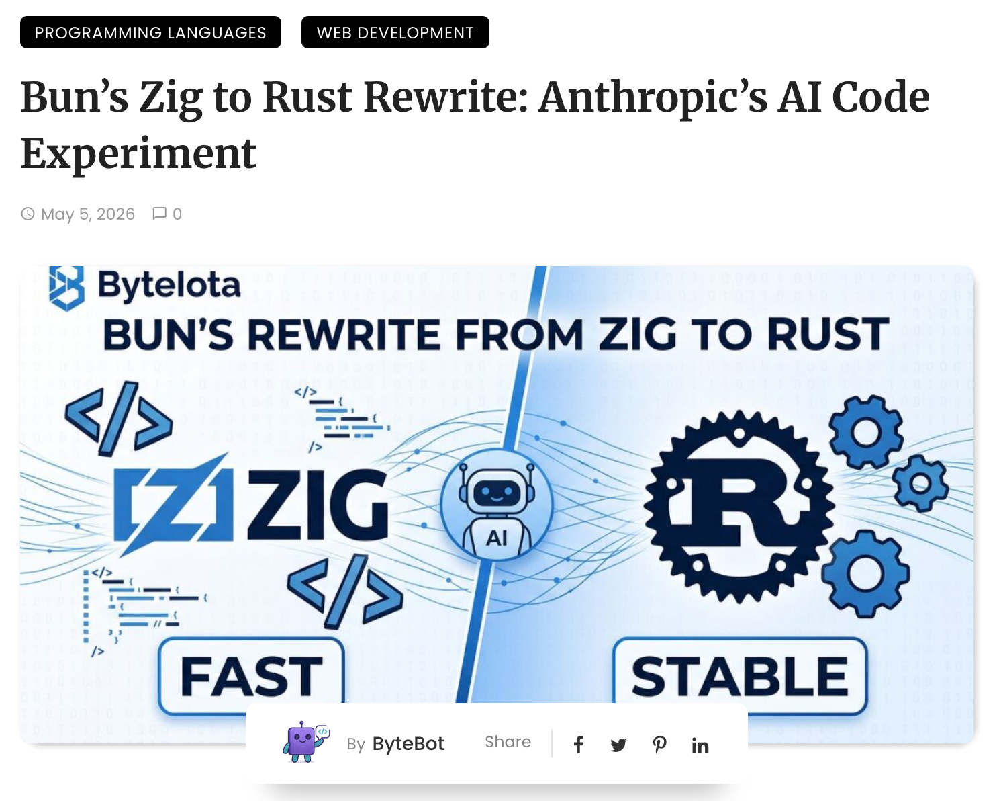]

---

# Roadrunner

.abspos.top141.left206.width600px[]


--

.abspos.top401.left395.textbox.red[Rust before]

--

.abspos.top323.left598.textbox.red[Rust with AI]

---

# Eat your vegetables

.center.p80[]

---

# Roadrunner

.abspos.top147.left453.width400px[]

--

.abspos.top167.left67.width400px[]

--

.abspos.top328.left134.textbox.red[Mythos]

.abspos.top353.left616.textbox.red[Memory<br>unsafety,<br>Reflection]

.abspos.top276.left818.textbox.red[Rust]

---

# Rust is used in Android Mobile

.abspos.top98.left45.p80.bordered[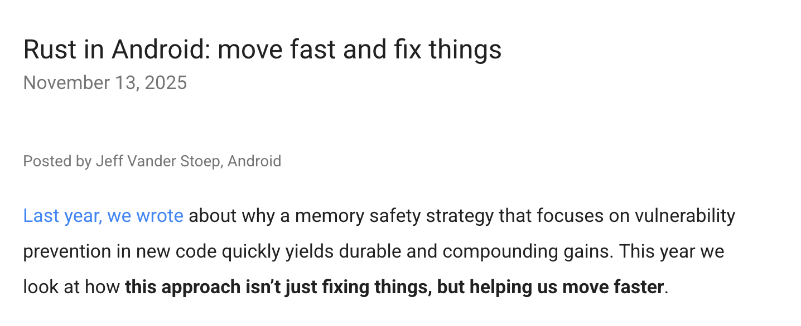]

.abspos.top256.left252.width600px.bordered[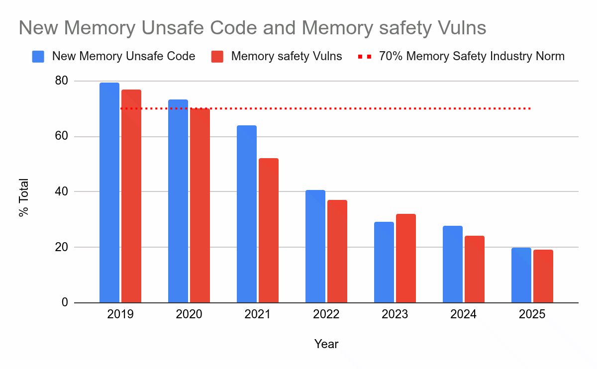]

--

.abspos.arrow.top317.left397.rotate135[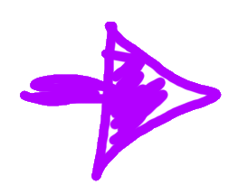]

.abspos.arrow.top339.left463.rotate135[]

.abspos.arrow.top385.left524.rotate135[]

.abspos.arrow.top425.left585.rotate135[]

.abspos.arrow.top441.left660.rotate135[]

.abspos.arrow.top465.left723.rotate135[]

.abspos.arrow.top477.left787.rotate135[]

.abspos.arrow.top349.left593.textbox.purple[Notice any relationship<br>between these lines?]

---

# Not just Google

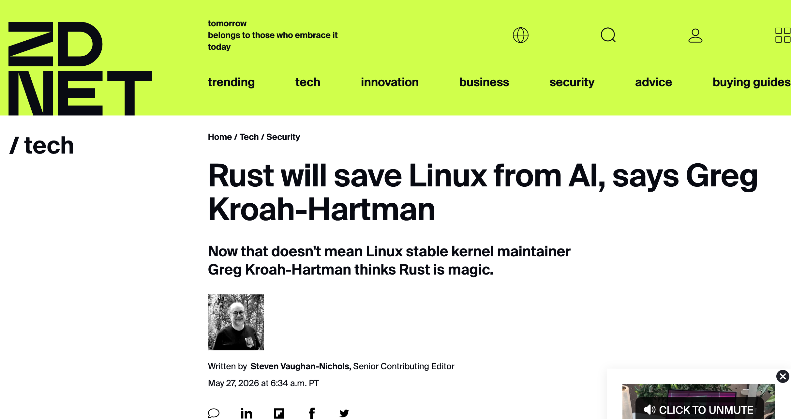

--
.abspos.arrow.top256.left651.rotate135[]

--

.abspos.top351.left561.width200px[]

---

# Not just memory safety

## Remember Log4Shell?

You heard it here first, (runtime) reflection is the new memory unsafety.

--

.center.p50[]

---

# When your slogan is "a stich in time, saves nine" in an agentic world...

.abspos.top146.left273.width400px[]

.abspos.top580.left385[Rust right now]

---

# If coding is cheap...

Pick a language, libraries, etc based not on the code you have now,

but based on the **code you want to maintain going forward**.

--

So why not...

* Save money *and*
* Reduce exposure to vulnerabilities?

---

# So... Rust + agents are good

## But could they be better?

---
name:toasty

# Example: Toasty

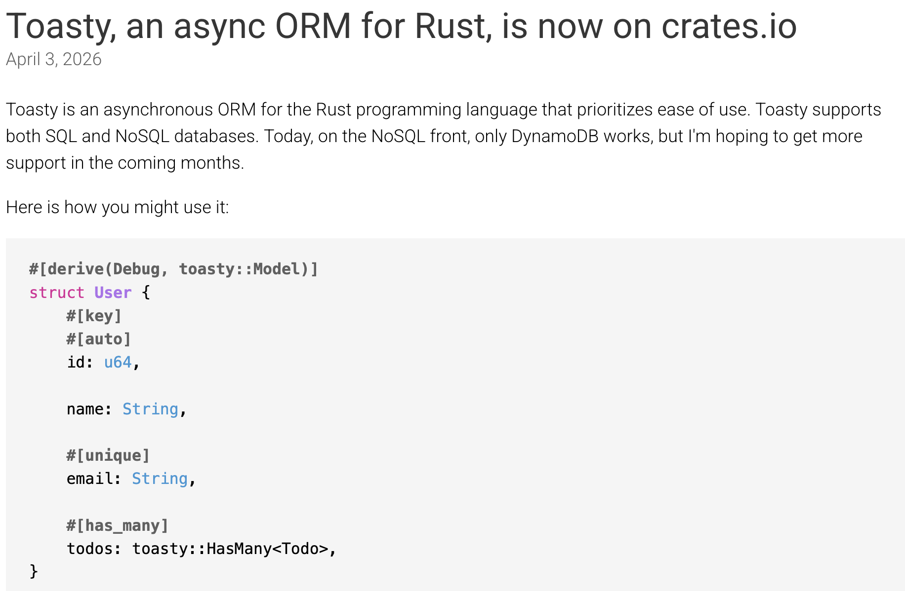

---
template:toasty
.abspos.arrow.top152.left1[]

---
template:toasty
.abspos.arrow.top326.left303.rotate135[]

---
template:toasty

.abspos.arrow.top389.left168.rotate135[]

.abspos.arrow.top491.left175.rotate135[]

.abspos.arrow.top546.left193.rotate135[]

---
name: using-toasty
# Example: Using Toasty

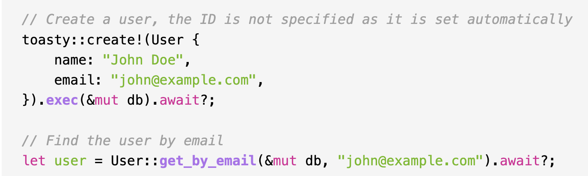

---
template: using-toasty
.abspos.arrow.top143.left237.rotate135[]

.abspos.arrow.top129.left280.textbox.purple[Macros and custom syntax]

---
template: using-toasty

.abspos.arrow.top293.left390.rotate130[]

.abspos.arrow.top263.left424.textbox.purple[New methods]

--

* **Guardrails:** API enforces type-safety, correct column names, etc
* **Versatility:** High-level and declarative
* **Efficiency:** Compiles to efficient code

---
template: using-toasty

* **Guardrails:** API enforces type-safety, correct column names, etc
* **Versatility:** High-level and declarative
* **Efficiency:** Compiles to efficient code

.abspos.arrow.top302.left569.rotate130[]

.abspos.arrow.top278.left610.textbox.purple[Type-safe, efficient]

---

# Claude doesn't even know it exists

"What library do you recommend for working with sqlite in Rust?"

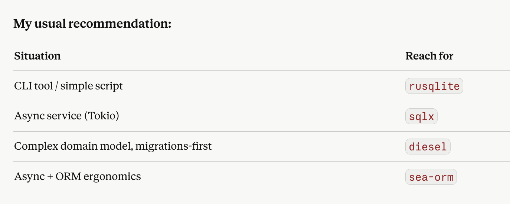

.footnote[
    For the record, these too are all excellent libraries!
]

---

# Claude, can you use toasty?

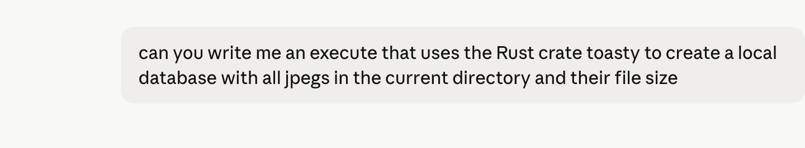

---

# Claude, can you use toasty?

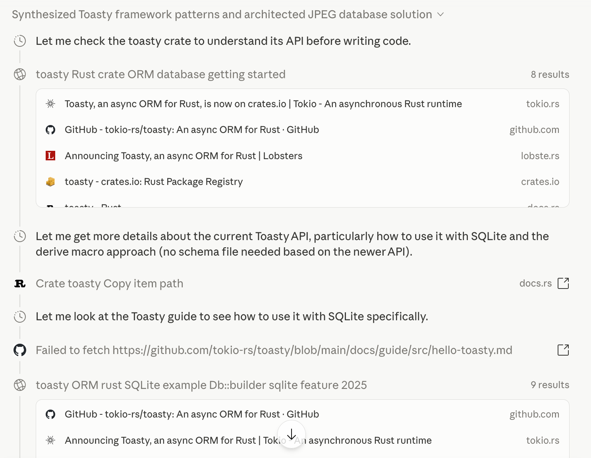

--

.abspos.arrow.top163.left572.textbox.purple[That's a lot of tokens...]

---

# Claude, can you use toasty?

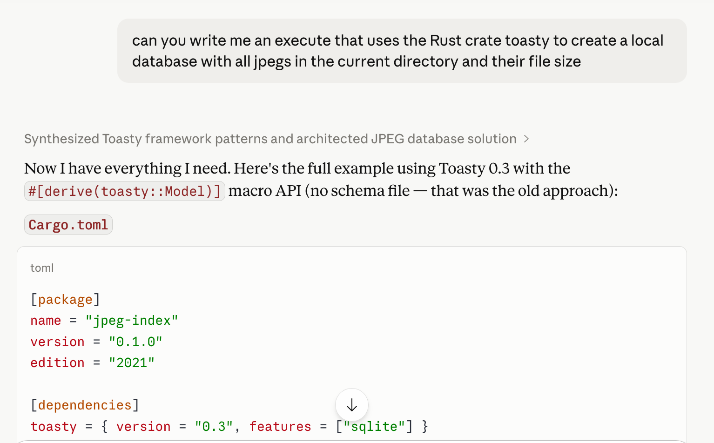

--

.abspos.arrow.top268.left608.rotate110[]

---

# Toasty on crates.io

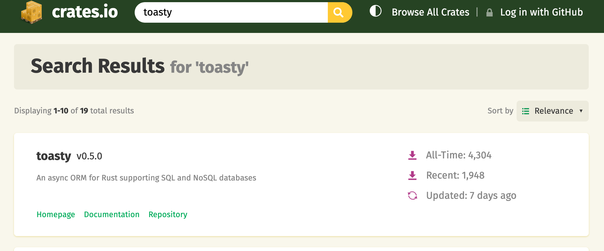

--

.abspos.arrow.top288.left168.rotate110[]

---

# The world is moving faster than ever

## Training data can't keep up

--


--

.abspos.arrow.top566.left230.rotate180[]

.abspos.arrow.top574.left282.textbox.purple[Rust 2024 hit stable Feb 2025]

---

# Most frustrating thing of all?

--

## ...the Rust org cannot help

.center[]
.abspos.arrow.top327.left317.textbox.purple[&nbsp;&nbsp;Anthropic<sup>1</sup>&nbsp;&nbsp;]

.footnote[
    <sup>1</sup> I should say: I tried that toasty example twice, and the second time, Claude did use Toasty 0.5. But it still made a Rust crate in the 2021 edition.
]

---

# ..and this is where Symposium comes in

.center[.p60[]]

---

# Member of the Rust Foundation's Innovation Lab


---

# Install symposium

```
$ cargo install symposium   # or cargo binstall!
```

--

```
$ cargo agents init
Setting up symposium for your user account.

Which agents do you use? (space to select, enter to confirm):
> [x] Claude Code
  [x] Codex CLI
  [ ] GitHub Copilot
  [ ] Gemini CLI
  [ ] Goose
  [x] Kiro
  [ ] OpenCode
```

---

# Symposium gives general guidance

* General Rust guidance, e.g.,
    * Use Rust 2024
    * Use `cargo add` to add crates so you get the latest version
    * Run `cargo fmt` after making edits

---

# Crate authors write skills

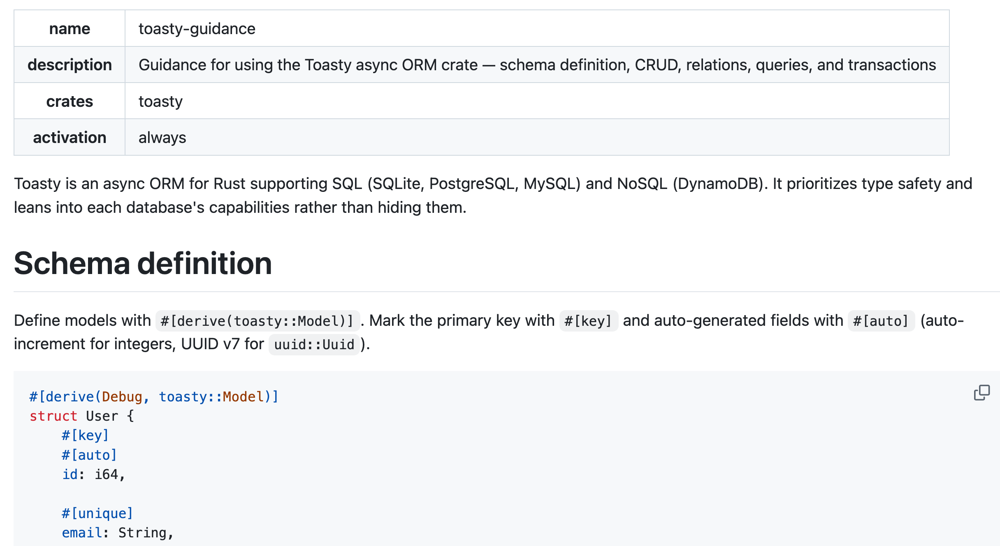

---

# Symposium installs skills automatically

* Install hooks:
    * After every tool use, we check for new relevant skills and install them
    * **Result:** After agent runs `cargo add toasty`, it knows how to use it

---
name: crate-info
# Symposium provides APIs to help agents

```bash
> cargo agents crate-info serde
Crate: serde
Version: 1.0.228
Source: /Users/nikomat/.cargo/registry/src/index.crates.io/serde-1.0.228
```

---
template: crate-info

.abspos.arrow.top153.left219.rotate135[]

.abspos.arrow.top139.left261.textbox.purple[Correct version used by your code]

---
template: crate-info

.abspos.arrow.top237.left326.rotate210[]

.abspos.arrow.top280.left374.textbox.purple[Let the agent browse full sources]

---

# Symposium aims to make agents extensible

.center["Everybody has something unique to offer"]

.center[.p60[]]

.abspos.arrow.top518.left305.textbox.purple[*"Release the Rust ecosystem!"*]

---

# Packaging up skills in the central repository

.abspos.top102.left175.width50px[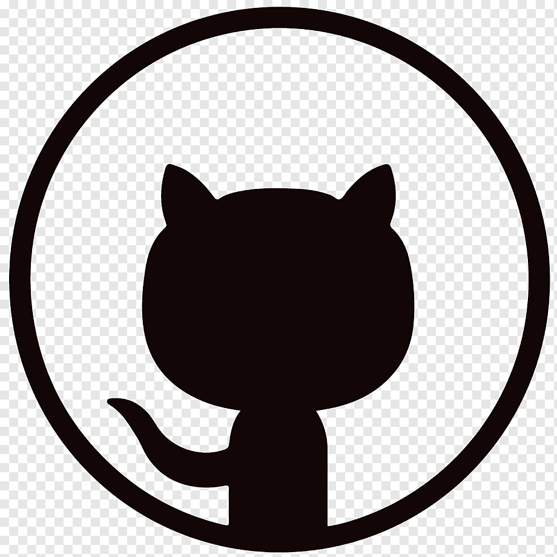]

.abspos.top127.left237[`symposium-dev/recommendations`]

--

.abspos.bluebox.top193.left174.width250px[
```text
toasty/
    SYMPOSIUM.toml
    create-model/
        SKILL.md
```
]

--

.abspos.purplebox.top179.left405.width400px[
```toml
# SYMPOSIUM.toml
name = "toasty"
crates = ["toasty"]

[[skills]]
source.path = "."
```
]

.abspos.arrow.top210.left351.rotate335[]

--

.abspos.purplebox.top379.left231.width600px[
```markdown
# SKILL.md
---
description: Create a model using the toasty crate
---

Here are code examples that create toasty models...
```
]

.abspos.arrow.top321.left304.rotate65[]

---
name:pkgwith

# Packaging up skills with your crate

.abspos.top102.left175.width50px[]

.abspos.top127.left237[`symposium-dev/recommendations`]

.abspos.bluebox.top193.left174.width250px[
```text
toasty/
    SYMPOSIUM.toml
```
]

.abspos.purplebox.top169.left365.width400px[
```toml
# SYMPOSIUM.toml
name = "toasty"
crates = ["toasty"]

[[skills]]
source = "crate"
```
]

---
template: pkgwith

.abspos.arrow.top323.left326[]

---
template: pkgwith

.abspos.top399.left175.width50px[]

.abspos.top423.left237[`tokio-rs/toasty`]

.abspos.bluebox.top480.left173.width250px[
```text
skills/
    create-model/
        SKILL.md
```
]

--

.abspos.purplebox.top455.left359.width500px[
```markdown
# SKILL.md
---
description: Create a model using the ...
---
...
```
]

--

.abspos.arrow.top258.left174.rotate315[]
.abspos.top314.left33.textbox[
    Temporary restriction<br>
    for security reasons
]

---
# Security implications

Letting dependencies install skill introduces a new threat vector.

But not fundamentally different from `build.rs` or other hooks.

---
name: mcp

# Packaging up MCP servers in the central repository

.abspos.top102.left250.width50px[]

.abspos.top127.left307[`symposium-dev/recommendations`]

.abspos.bluebox.top193.left174.width250px[
```text
my-crate/
    SYMPOSIUM.toml
```
]

.abspos.purplebox.top179.left405.width400px[
```toml
# SYMPOSIUM.toml
name = "my-crate"
crates = ["my-crate"]

[[installations]]
name = "my-crate-mcp"
source = "cargo"
crate = "my-crate-helper"
version = "1.0.0"
args = ["--mcp"]

[[mcp-server]]
name = "my-crate"
command = "my-crate-mcp"
```
]

---
template:mcp

.abspos.arrow.top301.left367[]

.abspos.top321.left112.textbox[Something installable]

---
template:mcp

.abspos.arrow.top393.left363[]

.abspos.top413.left65.textbox[Install with `cargo install`]

---
template:mcp

.abspos.arrow.top562.left364[]

.abspos.top561.left109.textbox[Install and<br>configure mcp-server]

---
name: hooks

# Packaging up hooks in the central repository

.abspos.top102.left250.width50px[]

.abspos.top127.left307[`symposium-dev/recommendations`]

.abspos.bluebox.top193.left174.width250px[
```text
my-crate/
    SYMPOSIUM.toml
```
]

.abspos.purplebox.top166.left405.width400px[
```toml
# SYMPOSIUM.toml
name = "my-crate"
crates = ["my-crate"]

[[installations]]
name = "my-crate-helper"
source = "cargo"
crate = "my-crate-hook"
version = "1.0.0"
args = ["--hook"]

[[hooks]]
name = "check-usage"
event = "PreToolUse"
command = "my-crate:hooks"
```
]


---
template:hooks

.abspos.arrow.top319.left365[]

.abspos.top341.left143.textbox["Hook" installation]

---
template:hooks

.abspos.arrow.top438.left365[]

.abspos.top459.left192.textbox[Different args]


---
template:hooks

.abspos.arrow.top549.left364[]

.abspos.top569.left153.textbox[Event(s) to accept]

---
# Zooming out -- remember this?

"What library do you recommend for working with sqlite in Rust?"


.footnote[
    For the record, these too are all excellent libraries!
]

---
# Getting started

.abspos.megamoj.top63.left609[🤔]

.abspos.top150.left207[.speech-bubble.ferris.right[
    What crates should I use<br>
    for my new network service?
]]

--

.abspos.width200px.top308.left36[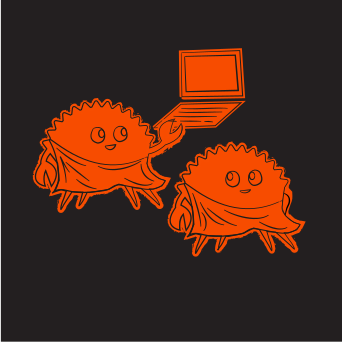]

.abspos.top371.left283[.speech-bubble.alan.left[
    Check out the battery packs!<br>
    <br>
    The opinionated-network-service is probably<br>
    just what you need!
]]

---
# Battery pack

.abspos.top150.left92.width150px[]
.abspos.top332.left75[Curated crate(s)]

--

.abspos.top144.left386.width150px[]
.abspos.top327.left360[Documentation & <br>Examples]

--

.abspos.top146.left658.width150px[]
.abspos.top327.left664[Skills]

---
# Example: Opinionated network service

* Documents key libraries
* Identifies common performance footguns or mistakes
* Integrates profiling

---
# Rust Commercial Network

.abspos.top113.left108.width700px.bordered[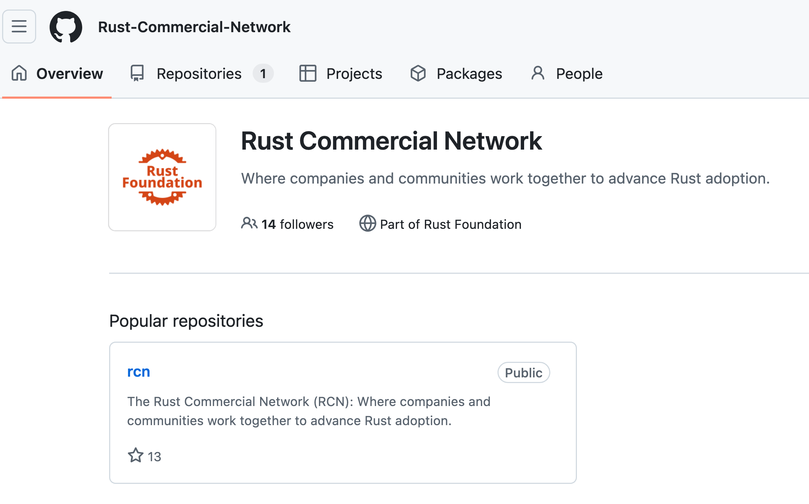]


---
# Takeaways

* Rust + AI = marshmallows + chocolate 🍫
* Symposium + Rust + AI = **s'mores** 😋
--
* Portability across agents today is **hard** 😠
* Agent Client Protocol (ACP) **could solve it** 👏🏽

---
# Symposium provides for interoperability

As a library author, write one set of extensions that work across agents...

--

...good luck with that.

---

# Even AGENTS.md is not universally supported

--

.abspos.bordered.width600px[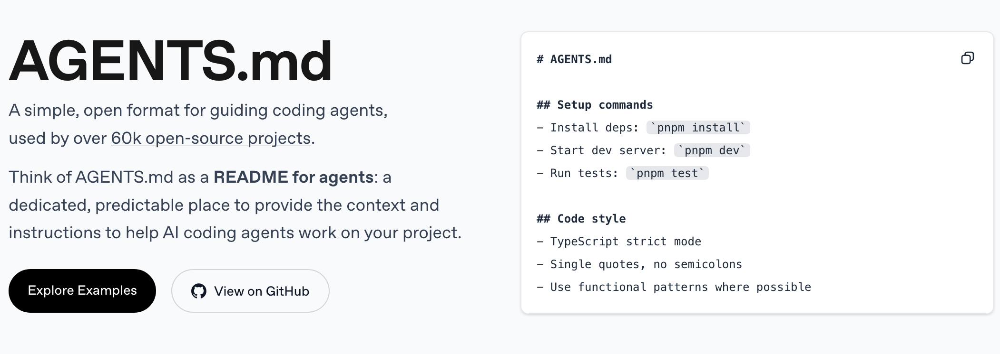]

.abspos.bordered.width600px.top315.left224[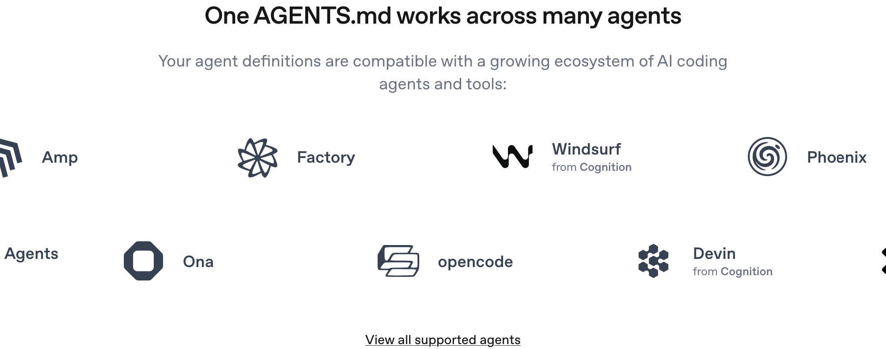]

---

# Niko to vendors...

.abspos.top165.left222[]

---

# Symposium does the best we can

.abspos.width100px.top112.left678[]

.abspos.textbox.top250.left607.width250px[
**Library:** provides extensions
* MCP servers
* Skills
* Hooks
]

--

.abspos.width100px.top123.left92[]


.abspos.textbox.top250.left16.width250px[
**User:** picks agent
* Claude Code
* Codex
* OpenCode
* Gemini
* etc
]

--

.abspos.width100px.top113.left374[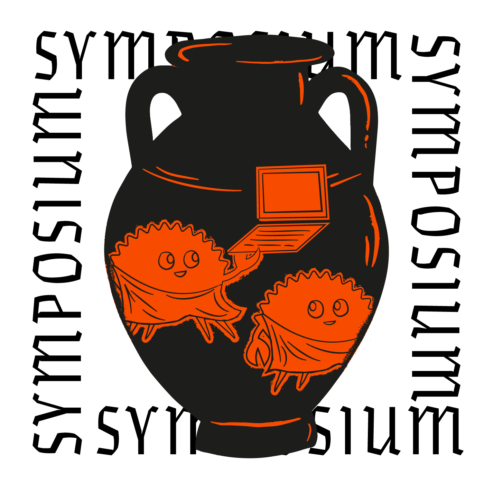]

.abspos.arrow.top143.left572[]

.abspos.arrow.top157.left249.rotate180[]

.abspos.textbox.top250.left287.width300px[
**Symposium:** adapts
* Load skills into the right directories for the agent user chose
* Converts between hook formats
]

---

# Skills are kinda annoying

.abspos.bluebox.top171.left48.width475px[
```text
$ cargo agents init
Setting up symposium for your user account.

Which agents do you use?
(space to select, enter to confirm):
  [ ] Claude Code
> [x] Codex CLI
  [ ] GitHub Copilot
  ...
```
]

--

.abspos.purplebox.top170.left545.width250px[
```
.agents/
    create-model/
        .gitignore
        SKILL.md
```
]

--

.abspos.turquoisebox.top321.left694.width200px[
```text
# .gitignore
*
```
]

.abspos.arrow.top271.left710.rotate65[]

---
name: annoying2

# Skills are kinda annoying

.abspos.bluebox.top171.left48.width475px[

```text
$ cargo agents init
Setting up symposium for your user account.

Which agents do you use?
(space to select, enter to confirm):
> [x] Claude Code
  [x] Codex CLI
  [ ] GitHub Copilot
  ...
```
]

---
template: annoying2

.abspos.arrow.top319.left28[]


---
template: annoying2

.abspos.purplebox.top170.left545.width250px[
```
.agents/
    create-model/
        .gitignore
        SKILL.md
```
]
--

.abspos.purplebox.top357.left545.width250px[
```
.claude/
    create-model/
        .gitignore
        SKILL.md
```
]

.abspos.arrow.top389.left514.rotate315[]

---
# Hooks are a total mess

* Every tool supports different hooks
* Every tool has a different *format* for hooks 

---
# Symposium approach

.abspos.width150px.top86.left19[]

.abspos.bluebox.top116.left176.width300px[
```toml
[[hooks]]
name = "check-usage"
event = "PreToolUse"
command = "my-crate:hooks"
```
]

.abspos.top96.left500.width300px[
* Symposium hook translates from agent into common format
* Response translated back
]

--

.abspos.width70px.top283.left105[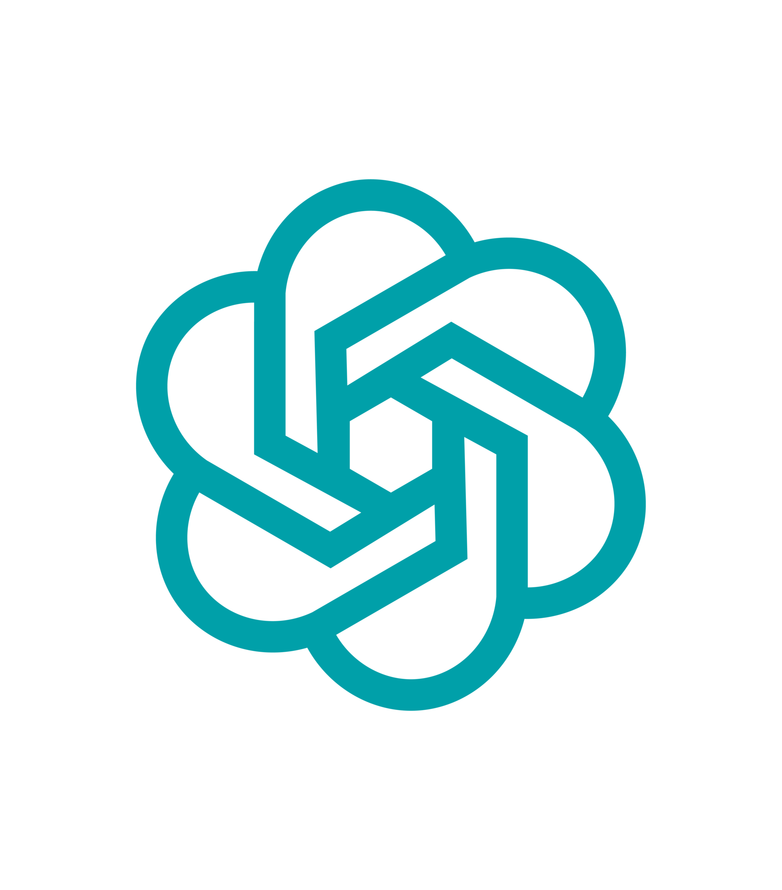]

.abspos.purplebox.top316.left176.width300px.small[
```toml
[[hooks]]
name = "check-usage"
event = "PreToolUse"
command = "my-crate:hooks"
format = "codex"
```
]

.abspos.top306.left500.width300px[
* Preferred when using Codex
]

.abspos.width50px.top466.left115[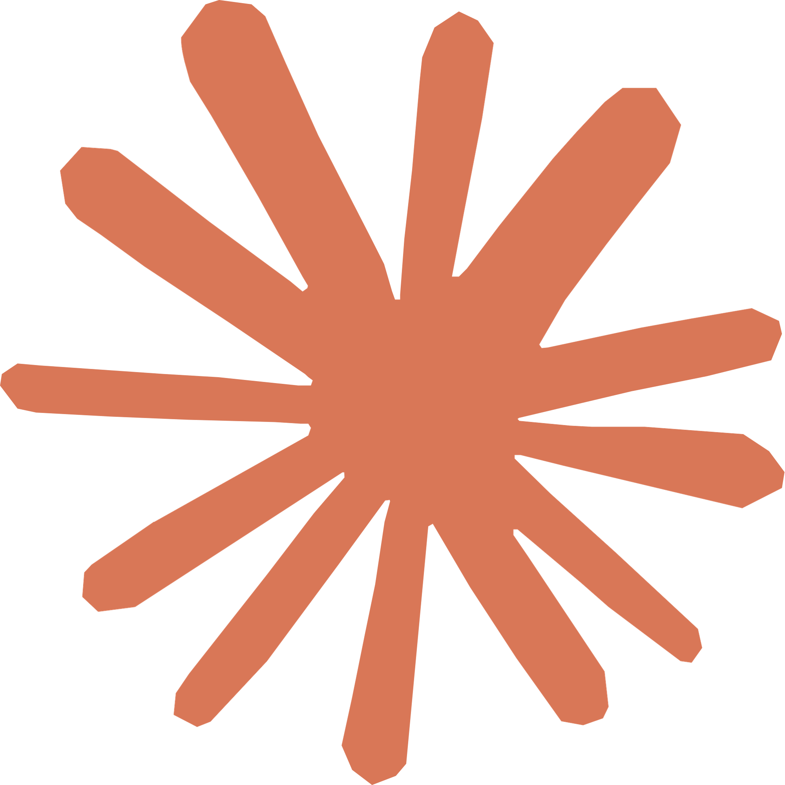]

.abspos.purplebox.top485.left176.width300px.small[
```toml
[[hooks]]
name = "check-usage"
event = "PreToolUse"
command = "my-crate:hooks"
format = "claude"
```
]

.abspos.top96.top457.left500.width300px[
* Preferred when using Claude Code
]

.abspos.top348.left78.fontSize80px[.hook-brace[{]]

.abspos.top392.left-25.rotate270[Specialized<br>variants]

.abspos.arrow.top402.left136[]

.abspos.arrow.top570.left135[]

---

# There has got to be a better way

Existing extension mechanisms are **ad-hoc**:

* Hacky to virtualize (skills)
* Non-portable (hooks)
* Limited (MCP servers, hooks, skills)

---

# ..and this is where the Agent Client Protocol (ACP) comes in

.abspos.top197.left372[]

---

# What is the Agent Client Protocol (ACP)?

.abspos.fliplr.width300px.top152.left72[]
.abspos.top470.left187[User]

.abspos.width300px.top148.left557[]
.abspos.top470.left676[Agent]

.abspos.width150px.top225.left395[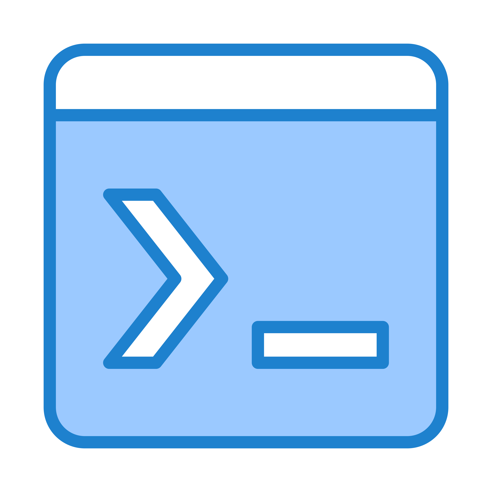]
.abspos.top470.left423[CLI/GUI]

.abspos.roundbox.top143.left386.width450px.height400px[&nbsp;]

---

# What is the Agent Client Protocol (ACP)?

.abspos.fliplr.width300px.top152.left5[]
.abspos.top470.left120[User]

.abspos.width300px.top148.left599[]
.abspos.top470.left676[Agent]

.abspos.width150px.top225.left320[]
.abspos.top470.left345[CLI/GUI]

.abspos.roundbox.top154.left19.width440px.height400px[&nbsp;]
.abspos.top564.left196[Client]

--

.abspos.arrow.top262.left528[]
.abspos.arrow.top310.left528.rotate180[]
.abspos.top374.left498[JSON-RPC]

---

# Original idea: 1 editor, N agents

.abspos.fliplr.width300px.top152.left5[]
.abspos.top470.left120[User]

.abspos.width125px.top230.left305[]
.abspos.top470.left340[Zed]

.abspos.width150px.top102.left557[]
.abspos.width200px.top297.left534[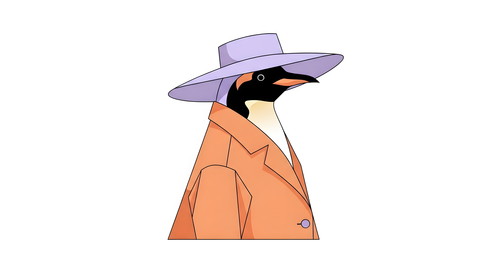]
.abspos.width240px.top437.left515[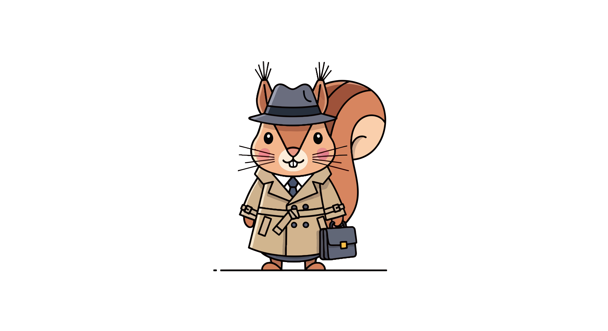]

.abspos.roundbox.top154.left19.width440px.height400px[&nbsp;]
.abspos.top564.left196[Client]

.abspos.top272.left590[Agent 1]
.abspos.top427.left590[Agent 2]
.abspos.top578.left590[Agent 3]

.abspos.arrow.top212.left494.rotate315[]
.abspos.arrow.top310.left498[]
.abspos.arrow.top405.left506.rotate45[]

---

# Agents

.abspos.width700px.top103.left93.bordered[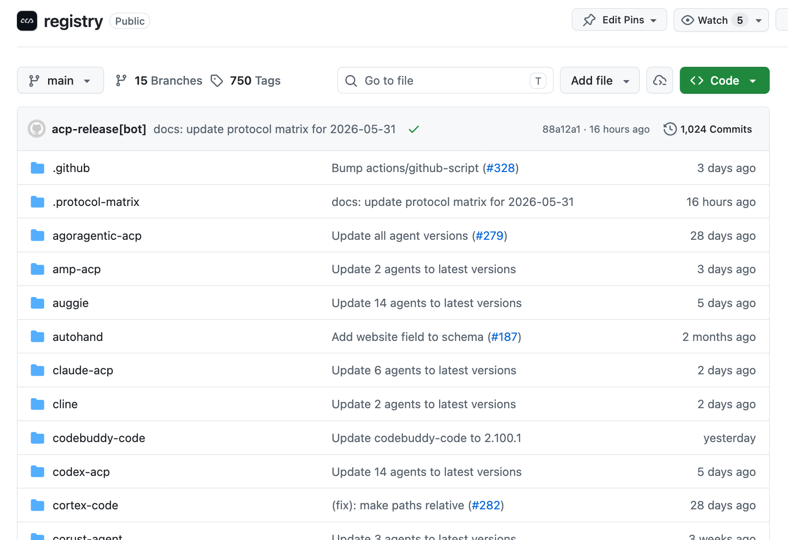]

---

# Editors

.abspos.top100.left124[Zed]
.abspos.width200px.top128.left49[]

.abspos.top100.left351[IntelliJ IDEs]
.abspos.width200px.top131.left332[]
.abspos.width200px.top276.left367[]
.abspos.width240px.top407.left405[]

.abspos.top399.left69[Emacs, neovim<br>(via extensions)]
.abspos.width100px.top466.left35[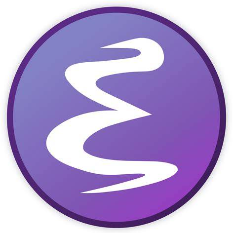]
.abspos.width125px.top495.left150[]

--

.abspos.top99.left596[Obsidian]
.abspos.width250px.top124.left588[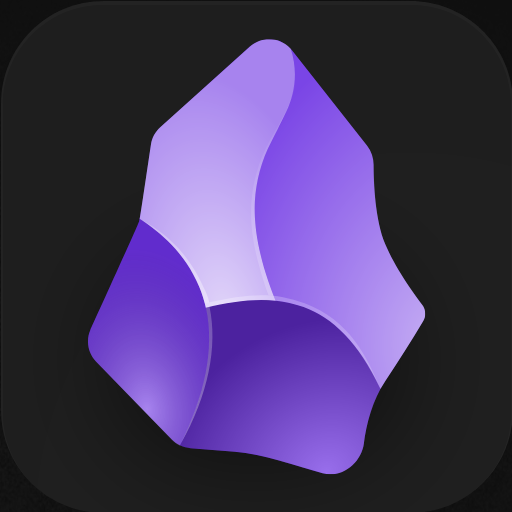]

--

.abspos.top418.left600[CLIs like Toad, Nori]
.abspos.width250px.top435.left578[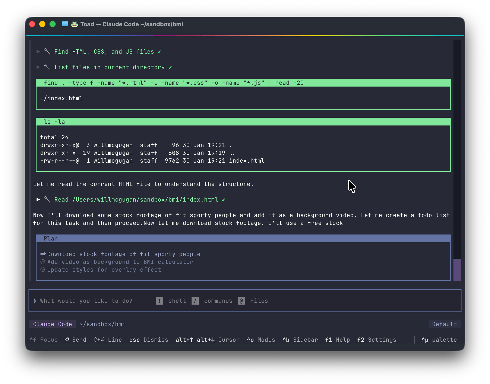]
.abspos.width250px.top481.left635[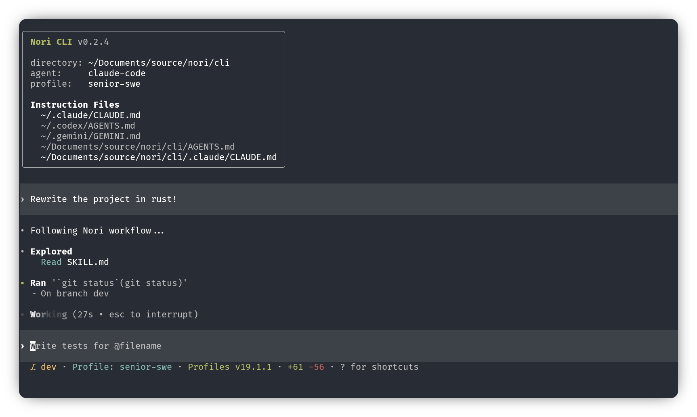]

---

# Beyond editors: ACPX

.abspos.width500px.top85.left214.bordered[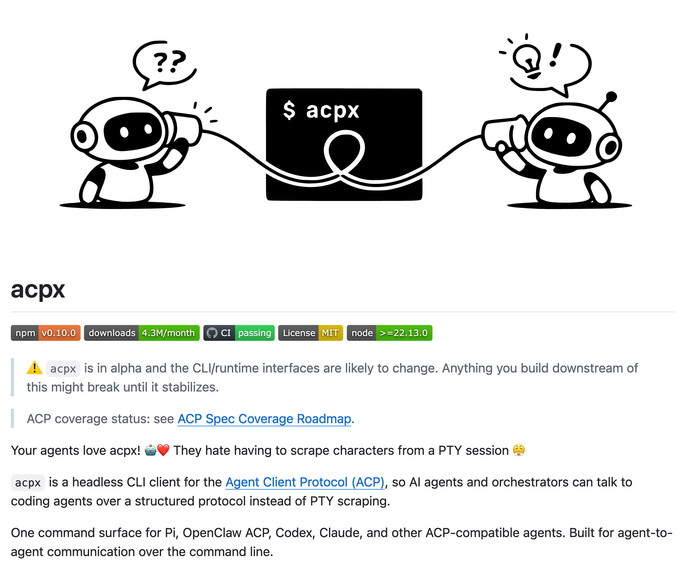]
.abspos.width500px.top505.left214.bordered[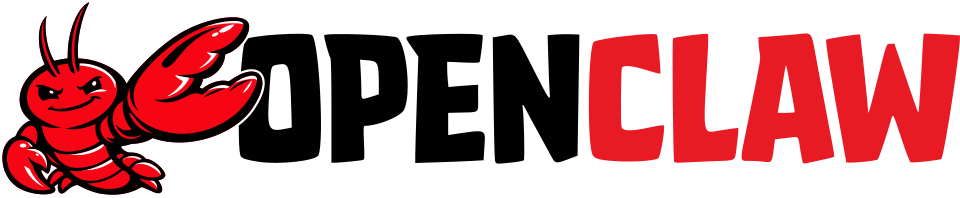]

---

# Scripting your agent

.abspos.width850px.top133.left25.bordered[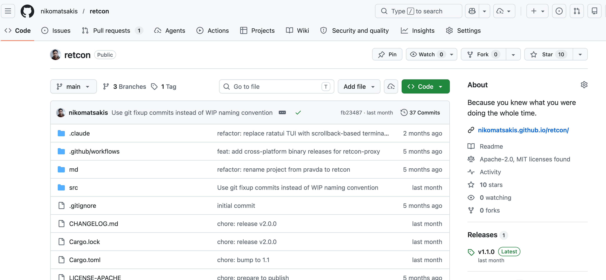]

---
name:scripting-your-agent-1

# Scripting your agent

.abspos.bordered.width600px.top110.left129[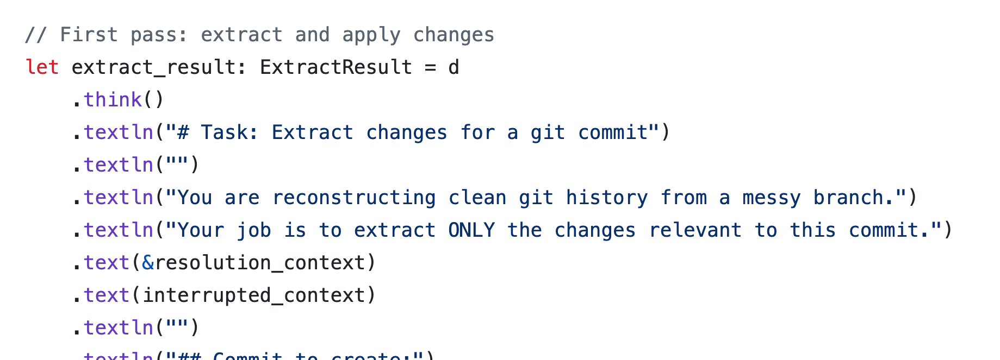]

---
template:scripting-your-agent-1

.abspos.arrow.top152.left115[]

---
template:scripting-your-agent-1

.abspos.arrow.top170.left119[]

---
template:scripting-your-agent-1

.abspos.arrow.top119.left371.rotate135[]

--

.abspos.bordered.width600px.top169.left217[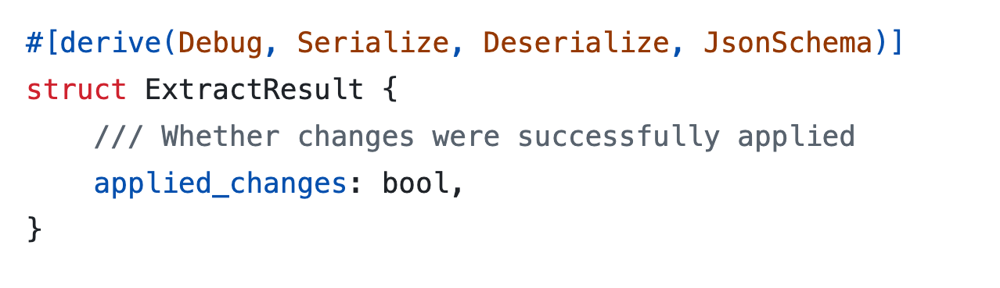]

--


.abspos.arrow.top297.left487.rotate215[]


---

# "Agent mods" (work in progress)

.abspos.fliplr.width300px.top153.left7[]
.abspos.top470.left91[Client]

.abspos.width300px.top147.left586[]
.abspos.top470.left710[Agent]

--

.abspos.width300px.top215.left311[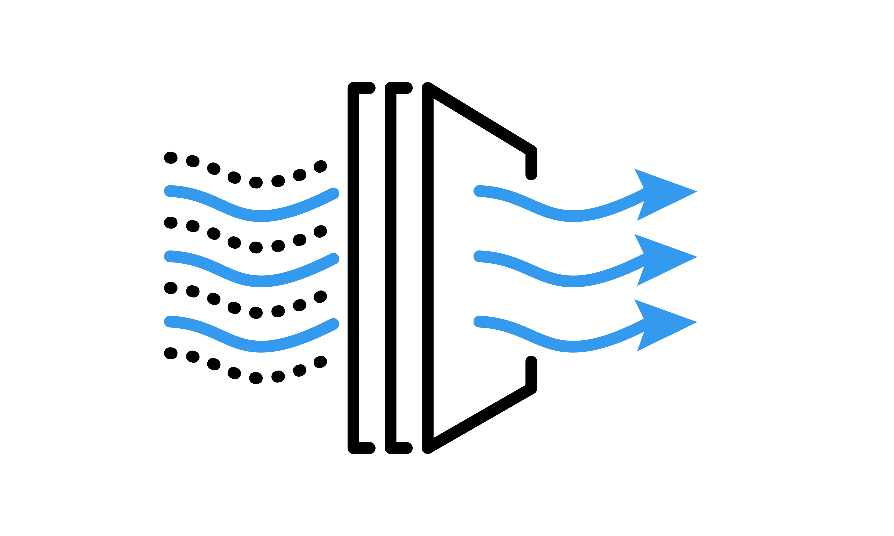]
.abspos.top470.left384[Agent mod]

---
# Takeaways

* Rust + AI = marshmallows + chocolate 🍫
--
* Symposium + Rust + AI = **s'mores** 😋
--
* Portability across agents today is **hard** 😠
--
* Agent Client Protocol (ACP) **could solve it** 👏🏽
--
.abspos.purplebox.width400px.height220px.top300.left34[
&nbsp;&nbsp;Try symposium

```
  $ cargo install symposium
  $ cargo agents init
```
]

.abspos.bluebox.width400px.height220px.top300.left452[
&nbsp;&nbsp;Curious about ACP?

&nbsp;&nbsp;https://agentclientprotocol.com
]

---
# Extra: Per-project setup

.abspos.width600px.top119.left167[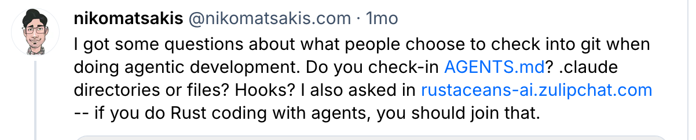]

--

.abspos.width600px.top280.left222[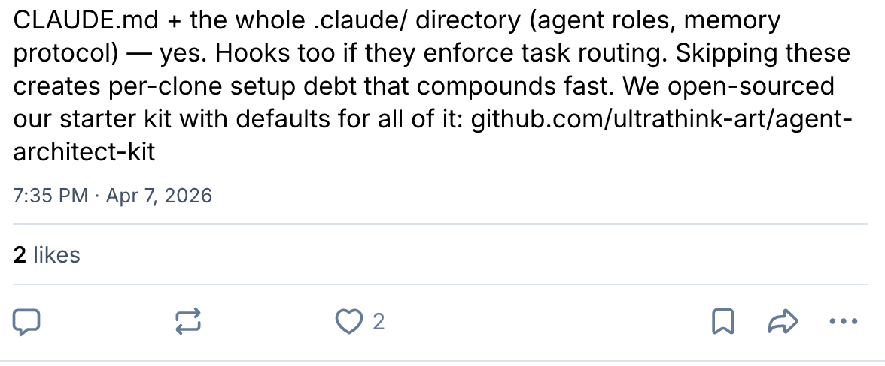]

--

.abspos.arrow.top259.left489.rotate135[]


---
name: ppsp1

# Per-project setup, portable

.abspos.purplebox.top100.left20.width500px[
```bash
my-project/
   .agents/
      skills/
         skill-for-my-project/
            SKILL.md
```
]

---
name: ppsp2
template: ppsp1

.abspos.bluebox.top87.left369.width500px[
```bash
my-project/
   .agents/
      skills/
         skill-for-my-project/
            SKILL.md
         skill-from-my-dependencies/
            .gitignore # "*"
            SKILL.md
   .claude/
      skills/
         skill-for-my-project/
            .gitignore # "*"
            SKILL.md
         skill-from-my-dependencies/
            .gitignore # "*"
            SKILL.md
```
]

.abspos.arrow.top318.left217.rotate90[]

.abspos.width150px.top350.left161[]

.abspos.arrow.top399.left310.rotate0[]

---
template: ppsp2

.abspos.arrow.top191.left410[]


---
template: ppsp2

.abspos.arrow.top250.left410[]


---
template: ppsp2

.abspos.arrow.top400.left410[]


---
template: ppsp2

.abspos.arrow.top489.left410[]
