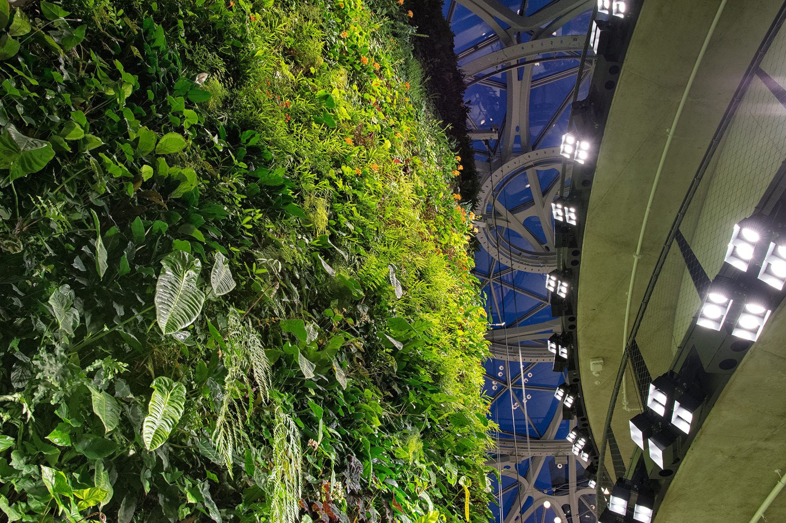
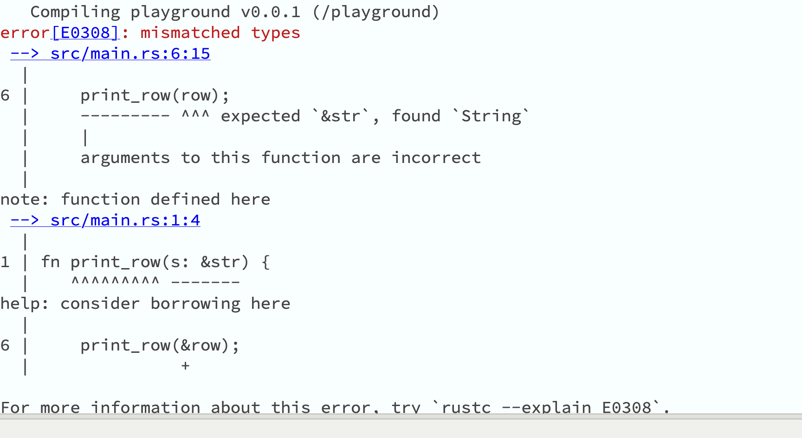

class: center
name: title
count: false

.p60[]

## RIIIR: Rewrite It In *Idiomatic* Rust (with AI)

.me[.grey[*by* **Nicholas Matsakis**]]
.left[.citation[View slides at `https://nikomatsakis.github.io/qcon-ai-2026/`]]

---

# Who am I?

One of the lead designers of Rust

.center[.p60[]]

---

# Who am I?

Senior Principal Engineer at Amazon

.center[.p60[]]

---

# Been working on Rust a long time

---

# "Eat your Spinach"

.center.p80[]

---

.center[
    .p40[]
    .p40[]
]

.center[.p60[]]

.footnote[
    [Strong ferris source](https://jackyzhen.github.io/rust-vs-go-slides/strongFerris.jpg)
]

---

* amazon

---

* microsoft

---

google article

* android

---

* linux kernel

---

I was resigned

---

But...something's changed now

---

OpenAI

---

Bun (Anthropic)

---

Within Microsoft

---

Within Amazon 

---

# What is Symposium?

* Extended Rust toolchain for agentic development

--
* Marquee feature:
    * Installing skills, hooks, etc based on your dependencies

---

# Member of the Rust Foundation's Innovation Lab


---

# Why Symposium?

---

# Who am I?

One of the lead designers of Rust

.center[.p80[]]

---

# Who am I?

Senior Principal Engineer at Amazon

.center[.p80[]]

---

# Not heard of Rust?

.abspos.top25.left519.width300px[]

*Low-level enough for a kernel...*

&nbsp;&nbsp;&nbsp;&nbsp;&nbsp;&nbsp;&nbsp;&nbsp;&nbsp; *usable enough for an application*

---

# Low-level enough for a kernel?

--

.abspos.top122.left98.width700px.bordered[]

--

.abspos.top282.left98.width700px.bordered[]

---

# High-level enough for an application?

--

.abspos.left50.top180.bordered[
<video controls autoplay muted loop style="width: 800px">
<source src="./images/ratatui.webm" type="video/webm">
</video>
]

.abspos.top563.left236[TUI oscilliscope written using ratatui]

---

# Rust has been on a roll lately

But two main things hold us back:

* "Rewrites are expensive, interop is hard"

--
* "Learning curve"

---

# Lately... things look a bit different

> My goal is to eliminate every line of C and C++ from Microsoft by 2030. Our strategy is to combine AI *and* Algorithms to **rewrite Microsoft’s largest codebases**. Our North Star is “1 engineer, 1 month, 1 million lines of code”.<br>
> <br>
> &mdash; Distinguished Engineer at Microsoft, [talking about a research project](https://www.linkedin.com/posts/galenh_principal-software-engineer-coreai-microsoft-activity-7407863239289729024-WTzf/) (emphasis mine)

---

# *Really* different

> If you’ve already tried Rust and found the learning curve too steep, give it another try with Claude Code or Codex as your pair programmer. **The experience is different when you have an AI that can navigate ownership and borrowing patterns** while you focus on building things.<br>
> <br>
> The tools finally catching up to the promise of the language.<br>
> <br>
> &mdash; Tigran Bayburtsyan, ["Coding Rust with Claude Code and Codex"](https://tigran.tech/coding-rust-with-claude-code-and-codex/) (emphasis mine)

---

# When using agents...

Pick a language, libraries, etc based not on the code you have now,

but based on the **code you want to maintain going forward**.

---

# When your slogan is "a stich in time, saves nine" in an agentic world...

--

.abspos.top146.left273.width400px[]

.abspos.top580.left385[Rust right now]

---

# Rust + LLM = dream-team?

* Guardrails

--
template:guardrails

.p80[]

.footnote[
    Co-founder and president of OpenAI.
]


---

# Rust + LLM = dream-team?

* Guardrails
* Versatility

--

.abspos.width600px.bordered.top212.left150[]

---

# Rust + LLM = dream-team?

* Guardrails
* Versatility
* Efficiency

--

.abspos.top100.left295.width600px.bordered[]

.abspos.top229.left40.width600px.bordered[]

.abspos.top332.left292.width600px.bordered[]

---

# Rust + LLM = dream-team?

* Guardrails
* Versatility
* Efficiency
* Investment in error messages

--

.center.megamoj[🤔]

---

# Error messages?



--

.abspos.arrow.top183.left260.rotate135[]

.abspos.arrow.top163.left302.textbox.purple[The base error]

--

.abspos.arrow.top353.left298.rotate135[]

.abspos.arrow.top341.left341.textbox.purple[Needed context]

--

.abspos.arrow.top441.left244.rotate135[]

.abspos.arrow.top426.left284.textbox.purple[How to fix]

---

# So... Rust + agents are good

## But could they be better?


---
name:toasty

# Example: Toasty


---
template:toasty
.abspos.arrow.top163.left6[]

---
template:toasty
.abspos.arrow.top326.left303.rotate135[]

---
template:toasty

.abspos.arrow.top389.left168.rotate135[]

.abspos.arrow.top491.left175.rotate135[]

.abspos.arrow.top546.left193.rotate135[]

---
name: using-toasty
# Example: Using Toasty


---
template: using-toasty
.abspos.arrow.top143.left237.rotate135[]

.abspos.arrow.top129.left280.textbox.purple[Macros and custom syntax]

---
template: using-toasty

.abspos.arrow.top293.left390.rotate130[]

.abspos.arrow.top263.left424.textbox.purple[New methods]

--

* **Guardrails:** API enforces type-safety, correct column names, etc
* **Versatility:** High-level and declarative
* **Efficiency:** Compiles to efficient code

---
template: using-toasty

* **Guardrails:** API enforces type-safety, correct column names, etc
* **Versatility:** High-level and declarative
* **Efficiency:** Compiles to efficient code

.abspos.arrow.top302.left569.rotate130[]

.abspos.arrow.top278.left610.textbox.purple[Type-safe, efficient]

---

# Claude doesn't even know it exists

"What library do you recommend for working with sqlite in Rust?"


.footnote[
    For the record, these too are all excellent libraries!
]

---

# Claude, can you use toasty?


---

# Claude, can you use toasty?


--

.abspos.arrow.top163.left572.textbox.purple[That's a lot of tokens...]

---

# Claude, can you use toasty?


--

.abspos.arrow.top278.left613.rotate110[]

---

# Toasty on crates.io


--

.abspos.arrow.top295.left160.rotate110[]

.abspos.arrow.top295.left160.rotate110[]

---

# The world is moving faster than ever

## Training data can't keep up

--


--

.abspos.arrow.top584.left228.rotate180[]

.abspos.arrow.top591.left280.textbox.purple[Rust 2024 hit stable Feb 2025]

---

# Most frustrating thing of all?

--

## ...the Rust org cannot help

.center[]
.abspos.arrow.top366.left313.textbox.purple[&nbsp;&nbsp;Anthropic<sup>1</sup>&nbsp;&nbsp;]

.footnote[
    <sup>1</sup> I should say: I tried that toasty example twice, and the second time, Claude did use Toasty 0.5. But it still made a Rust crate in the 2021 edition.
]

---

# ..and this is where Symposium comes in

.center[.p60[]]

---

# Install symposium

```
$ cargo install symposium   # or cargo binstall!
```

--

```
$ cargo agents init
Setting up symposium for your user account.

Which agents do you use? (space to select, enter to confirm):
> [x] Claude Code
  [x] Codex CLI
  [ ] GitHub Copilot
  [ ] Gemini CLI
  [ ] Goose
  [x] Kiro
  [ ] OpenCode
```

---

# Symposium gives general guidance

* General Rust guidance, e.g.,
    * Use Rust 2024
    * Use `cargo add` to add crates so you get the latest version
    * Run `cargo fmt` after making edits

---

# Symposium lets you write skills for crates


--

.abspos.top195.left28.arrow[]

---

# Symposium installs skills automatically

* Install hooks:
    * After every tool use, we check for new relevant skills and install them
    * **Result:** After agent runs `cargo add toasty`, it knows how to use it

---
name: crate-info
# Symposium provides APIs to help agents

```bash
> cargo agents crate-info serde
Crate: serde
Version: 1.0.228
Source: /Users/nikomat/.cargo/registry/src/index.crates.io/serde-1.0.228
```

---
template: crate-info

.abspos.arrow.top169.left221.rotate135[]

.abspos.arrow.top150.left265.textbox.purple[Correct version used by your code]

---
template: crate-info

.abspos.arrow.top257.left340.rotate210[]

.abspos.arrow.top308.left373.textbox.purple[Let the agent browse full sources]

---

# Symposium aims to make agents extensible

.center["Everybody has something unique to offer"]

.center[.p60[]]

.abspos.arrow.top518.left305.textbox.purple[*"Release the Rust ecosystem!"*]

---

# Symposium provides for interoperability

As a library author, write one set of extensions that work across agents...

--

...good luck with that.

---

# Even AGENTS.md is not universally supported

--

.abspos.bordered.width600px[]

.abspos.bordered.width600px.top315.left224[]

---

# Niko to vendors...

.abspos.top165.left222[]

---

# Symposium does the best we can

* Library (crate) provides extensions
    * MCP servers
    * Skills
    * Hooks
--


* User picks agent

--


* Symposium adapts
    * Load skills into the right directories for the agent user chose
    * Converts between hook formats

---

# Conclusions

* If you want something to be amazing:
    * Unleash the ecosystem!

--

* Symposium aims to take a good thing (Rust + LLMs) and make it **better**:
    * Skills and extensions based on what you use
    * Up-to-date guidance

--

Use Rust? Try it now!

```
$ cargo binstall symposium
$ cargo agents init
```

.abspos.top353.left459[]